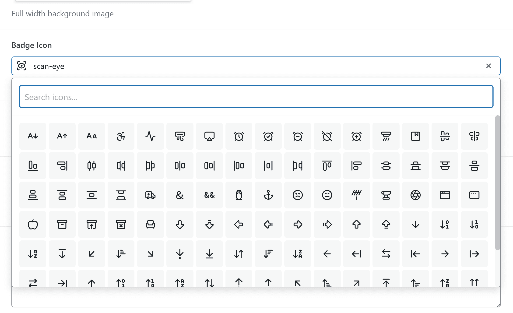

# Mudrava Icon Field for ACF with Lucide

A professional ACF (Advanced Custom Fields) custom field type for selecting [Lucide](https://lucide.dev/) icons and [Simple Icons](https://simpleicons.org/) brand logos with a visual picker interface.



[](https://wordpress.org/plugins/mudrava-acf-lucide-field/)
[](https://wordpress.org/plugins/mudrava-acf-lucide-field/)


## Description

Mudrava Icon Field for ACF with Lucide adds a new field type to Advanced Custom Fields that allows users to select icons from the Lucide icon library and brand logos from Simple Icons through an intuitive visual picker. The selected icon value is stored in the database, making it lightweight and flexible for frontend rendering.

### Features

- **Visual Icon Picker** - Browse and select from 1,791 Lucide icons and 3,457 brand logos
- **Brand Icons** - Brand logos use Simple Icons values such as `simple:facebook`
- **Smart Search** - Filter icons by name or build-time search tags instantly
- **Performant** - Lazy icon catalog over a local REST endpoint, byte-offset sprite lookups (no full-file scans), inline frontend SVG output, paginated grid (100 icons per page)
- **No External Requests** - Lucide and Simple Icons assets are bundled locally
- **Native ACF Look** - Seamlessly integrates with ACF's design language
- **Responsive** - Works on all screen sizes
- **Accessible** - Keyboard navigation support
- **Flexible Output** - Return icon value or full SVG markup

## Requirements

- WordPress 6.0 or higher
- PHP 7.4 or higher
- ACF 6.0 or higher

## Installation

### Manual Installation

1. Download the plugin from [WordPress.org](https://wordpress.org/plugins/mudrava-acf-lucide-field/) or from [GitHub Releases](https://github.com/Mudrava/mudrava-acf-lucide-field/releases)
2. Go to **Plugins > Add New > Upload Plugin**
3. Upload the zip file and click **Install Now**
4. Activate the plugin

### Via Git

```bash
cd wp-content/plugins
git clone https://github.com/Mudrava/mudrava-acf-lucide-field.git mudrava-acf-lucide-field
```

## Usage

### Creating a Lucide Icon Field

1. Go to **Custom Fields > Add New**
2. Add a new field and select **Lucide Icon** as the field type
3. Configure the field settings:
   - **Default Value** - Pre-selected icon value (e.g., `rocket` or `simple:facebook`)
   - **Return Format** - Choose between icon value or SVG markup
   - **Allow Null** - Allow the field to have no selection
4. Save your field group

### Retrieving the Value

#### Get Icon Name

```php
<?php
$icon_name = get_field('your_field_name');
// Returns: 'rocket' or 'simple:facebook'
?>
```

#### Get SVG Markup (with return_format = 'svg')

```php
<?php
$icon_svg = get_field('your_field_name');
// Returns: '<svg>...</svg>'

echo $icon_svg;
?>
```

#### Using the Helper Function

The plugin provides a helper function for rendering icons with custom attributes:

```php
<?php
// Basic usage
echo mudrava_get_lucide_icon('rocket');

// Brand logo
echo mudrava_get_lucide_icon('simple:facebook');

// With custom attributes
echo mudrava_get_lucide_icon('rocket', [
    'class'  => 'my-custom-class',
    'width'  => 32,
    'height' => 32,
    'stroke' => '#ff0000',
]);
?>
```

### Template Examples

#### Display Icon in a Block

```php
<?php
$icon = get_field('icon');
if ($icon) {
    echo mudrava_get_lucide_icon($icon, ['class' => 'feature-icon']);
}
?>
```

#### Icon with Link

```php
<?php
$icon = get_field('social_icon');
$url = get_field('social_url');

if ($icon && $url) : ?>
    <a href="<?php echo esc_url($url); ?>" class="social-link">
        <?php echo mudrava_get_lucide_icon($icon, ['width' => 20, 'height' => 20]); ?>
    </a>
<?php endif; ?>
```

#### Using in Repeater Fields

```php
<?php if (have_rows('features')) : ?>
    <div class="features-grid">
        <?php while (have_rows('features')) : the_row(); ?>
            <div class="feature">
                <?php
                $icon = get_sub_field('icon');
                if ($icon) {
                    echo mudrava_get_lucide_icon($icon, ['class' => 'feature-icon']);
                }
                ?>
                <h3><?php the_sub_field('title'); ?></h3>
                <p><?php the_sub_field('description'); ?></p>
            </div>
        <?php endwhile; ?>
    </div>
<?php endif; ?>
```

## API Reference

### `mudrava_get_lucide_icon( string $icon_name, array $args = [] ): string`

Retrieves the SVG markup for a Lucide icon or Simple Icons brand logo.

#### Parameters

| Parameter | Type | Description |
|-----------|------|-------------|
| `$icon_name` | string | Icon value (e.g., `rocket` or `simple:facebook`) |
| `$args` | array | Optional. Customization arguments |

#### Arguments

| Key | Type | Default | Description |
|-----|------|---------|-------------|
| `class` | string | `''` | Additional CSS classes |
| `width` | int | `24` | Icon width in pixels |
| `height` | int | `24` | Icon height in pixels |
| `stroke` | string | `'currentColor'` | Stroke color |
| `stroke_width`| int | `2` | Stroke width |
| `fill` | string | `''` | Fill color for brand icons. Defaults to `stroke` |
| `title` | string | `''` | Accessible `<title>`; empty means `aria-hidden` |
| `mode` | string | `'inline'` | `inline` embeds the paths, `sprite` uses `<use>` and queues the symbol for sprite output |

#### Hooks

| Hook | Type | Description |
|------|------|-------------|
| `mudrava_lucide_field_icons_permission` | filter | Override the REST icon-catalog permission check (default: logged in) |
| `mudrava_lucide_field_icon_data` | filter | Modify the REST catalog payload |
| `mudrava_lucide_icon_svg_args` | filter | Modify `mudrava_get_lucide_icon()` arguments |
| `mudrava_lucide_icon_svg` | filter | Modify the final SVG markup |
| `mudrava_lucide_field_svg_args` | filter | Modify the SVG args returned by `get_field()` when the field's return format is SVG (`$args, $field, $value`) |
| `mudrava_lucide_field_upload_permission` | filter | Override the capability required to manage custom uploaded icons (default: ACF's `capability` setting, falling back to `manage_options`) |
| `mudrava_lucide_field_custom_icons` | filter | Modify the custom-icon manifest returned to the picker and renderer |
| `mudrava_lucide_field_custom_icons_dir` | filter | Override the directory used to store sanitized custom icon files |

#### Custom Icons

Site owners can extend the picker with their own SVG icons via **Settings → Custom Icons**.
Uploaded files are parsed and sanitized on upload (DOM parse with no network entity loading,
then a strict element/attribute allowlist via `wp_kses()`); the raw upload never touches disk.
Custom icons are addressed as `custom:<name>` in the field, in the picker and in the
shortcode/helper, and render with their own colors (`mudrava-lucide-icon-svg--custom`) rather
than the forced `currentColor` paint used by the bundled sets:

```
[lucide_icon name="custom:my-logo" title="My Logo"]
```

The storage name is derived from the title you enter (lowercase, dashes, max 64 characters);
uploads never overwrite existing icons. The management page requires ACF's configured
capability (see `mudrava_lucide_field_upload_permission`), verifies a nonce on every upload
and delete, and stores files outside the web-root listing (`index.php` plus a deny `.htaccess`).

#### Shortcode

```
[lucide_icon name="rocket" size="32" class="my-class" title="Launch"]
[lucide_icon name="simple:facebook" fill="#1877f2"]
```

#### Returns

`string` - The SVG markup or empty string on failure.

## Field Settings

| Setting | Description |
|---------|-------------|
| **Default Value** | Icon value to pre-select when field is empty |
| **Return Format** | `name` returns icon value, `svg` returns full SVG markup |
| **Placeholder** | Custom placeholder text for the search input |
| **Allow Null** | When enabled, allows clearing the selection |
| **Unknown Icon Values** | `warn` (default) keeps saving and shows an admin notice, `error` blocks saving. Requires ACF Pro for the setting UI; the `warn` behavior applies otherwise |

## Frequently Asked Questions

### Can I use this with the free version of ACF?

Yes. The field type works with Advanced Custom Fields 6.0 or higher. It also works inside ACF Pro field groups such as Repeaters and Flexible Content.

### Are the icons bundled with the plugin?

Yes. Lucide `1.38.0` (`lucide-static`) and Simple Icons `16.29.0` sprite files are bundled locally for optimal performance. No external CDN requests are made.

### How often is the icon library updated?

Version `1.2.0` updates the bundled assets to `lucide-static@1.38.0` and `simple-icons@16.29.0`, and introduces a compatibility-alias layer so removed upstream icon names keep rendering.

New brand values are saved as `simple:<slug>`, for example `simple:facebook`. Legacy unprefixed social values such as `facebook`, `instagram`, `twitter`, or `youtube` are resolved against Simple Icons when they no longer exist in Lucide.

### What happens if an icon is removed in a library update?

Saved values are never rewritten. Removed Lucide names from the 1.38.0 sync (`angry`, `annoyed`, `frown`, `history`, `laugh`, `meh`, `smile`, `smile-plus`, `podcast`) are mapped to their canonical replacements in `data/compat-aliases.json` (for example `smile` renders as `face-slightly-smiling`). Values with no alias at all keep saving and surface as a dismissible admin notice instead of a hard validation failure; switch the field setting **Unknown Icon Values** to `error` if you prefer strict blocking.

### Can I use brand logos freely?

Simple Icons is distributed under CC0-1.0, but brand logos and trademarks may still be governed by each brand owner's guidelines and permissions. Check the relevant brand guidelines before using a logo in production. Source and guideline URLs from Simple Icons are bundled in `data/brand-icons-meta.json`, and third-party notices are documented in [docs/THIRD-PARTY-NOTICES.md](docs/THIRD-PARTY-NOTICES.md).

### Does it support RTL languages?

Yes, the plugin includes RTL (right-to-left) support.

### How do updates work?

The plugin is distributed via the [WordPress.org Plugin Directory](https://wordpress.org/plugins/mudrava-acf-lucide-field/). Updates are delivered automatically through the standard WordPress update system.

## Changelog

See [CHANGELOG.md](CHANGELOG.md) for a complete version history.

## Contributing

Contributions are welcome! Please read our contributing guidelines before submitting a pull request.

1. Fork the repository
2. Create your feature branch (`git checkout -b feature/amazing-feature`)
3. Commit your changes (`git commit -m 'Add amazing feature'`)
4. Push to the branch (`git push origin feature/amazing-feature`)
5. Open a Pull Request

## Links

- **WordPress.org**: [wordpress.org/plugins/mudrava-acf-lucide-field](https://wordpress.org/plugins/mudrava-acf-lucide-field/)
- **Plugin Page**: [mudrava.com/en/projects/mudrava-acf-lucide-field](https://mudrava.com/en/projects/mudrava-acf-lucide-field)
- **GitHub**: [github.com/Mudrava/mudrava-acf-lucide-field](https://github.com/Mudrava/mudrava-acf-lucide-field)
- **Architecture & design decisions**: [docs/ARCHITECTURE.md](docs/ARCHITECTURE.md)
- **Security policy**: [SECURITY.md](SECURITY.md)
- **Contributing guide**: [CONTRIBUTING.md](CONTRIBUTING.md)
- **Lucide Icons**: [lucide.dev](https://lucide.dev/)
- **Simple Icons**: [simpleicons.org](https://simpleicons.org/)

## Credits

- [Lucide Icons](https://lucide.dev/) - The UI icon library
- [Simple Icons](https://simpleicons.org/) - Brand logo icons
- [Advanced Custom Fields](https://www.advancedcustomfields.com/) - The ACF framework

## License

This project is licensed under the GPL-2.0-or-later License. See the [LICENSE](LICENSE) file for details.

## Author

**Mudrava**  
[https://mudrava.com/en/](https://mudrava.com/en/)
